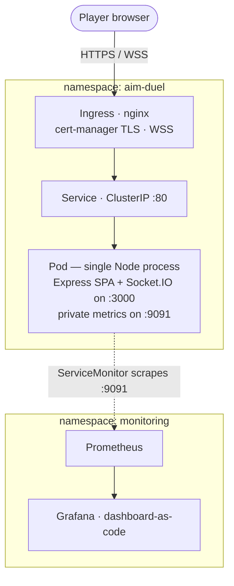
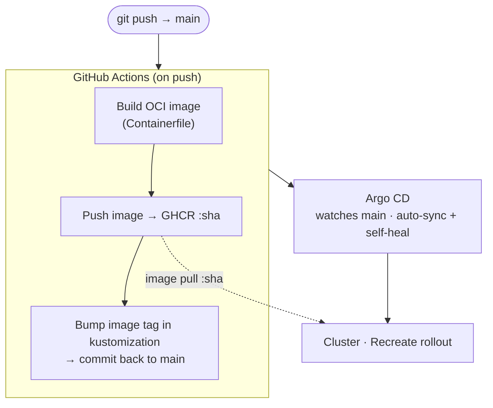
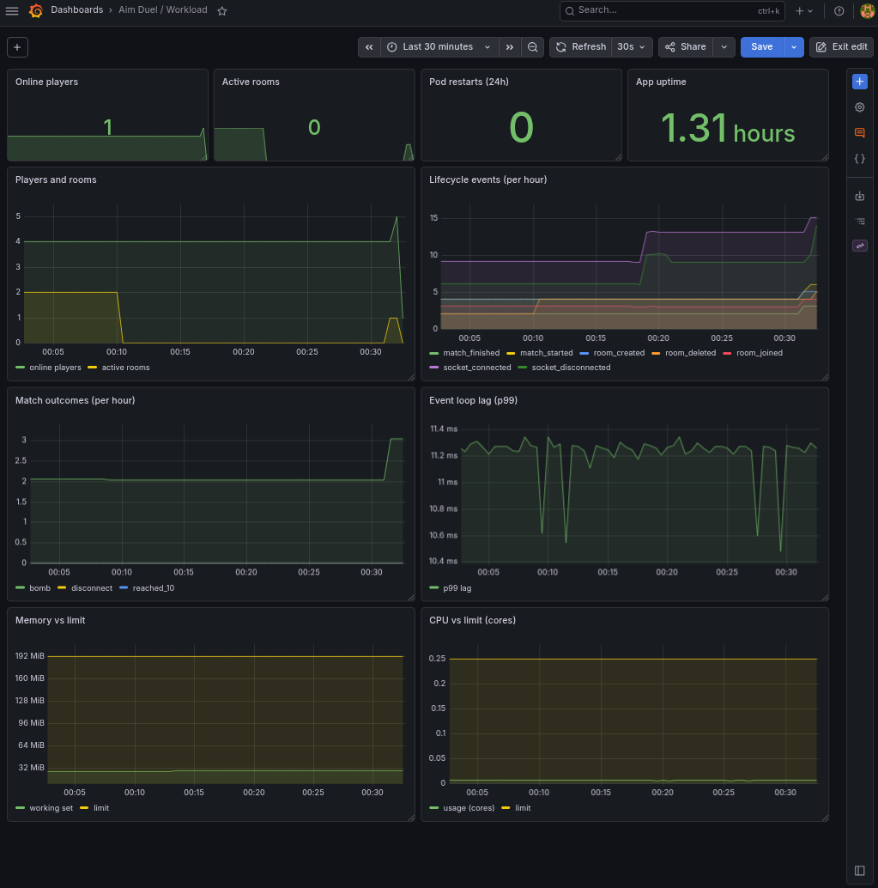
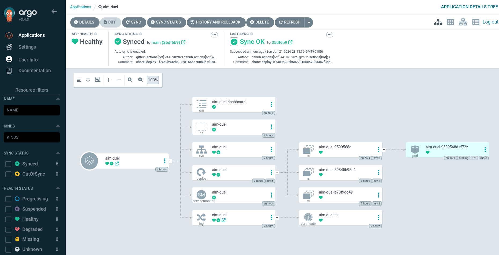
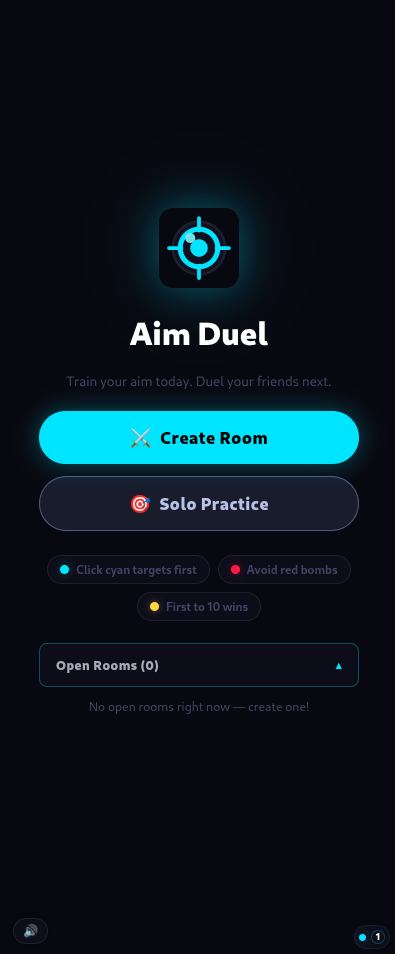
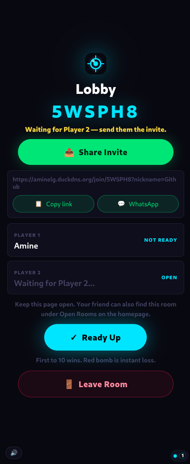
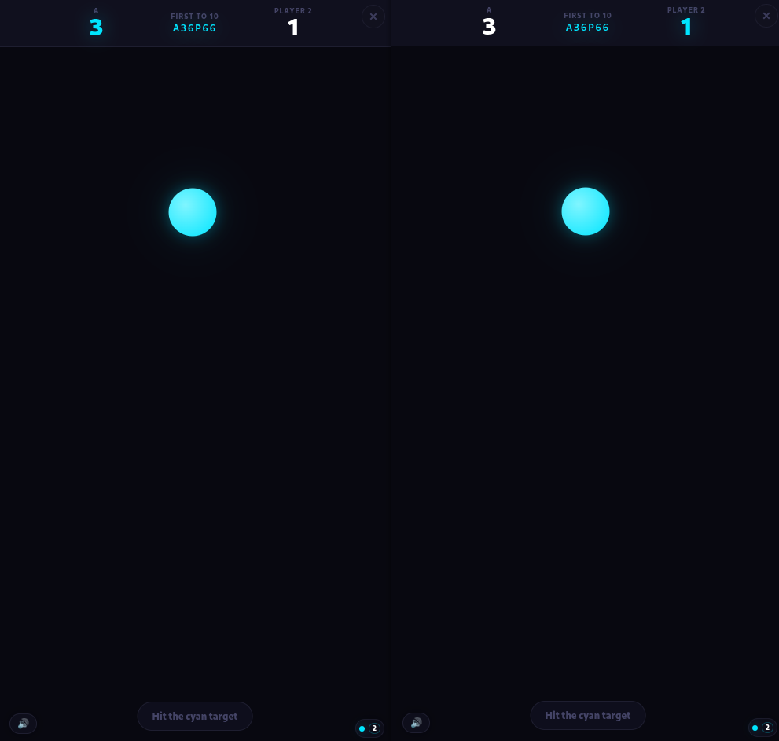
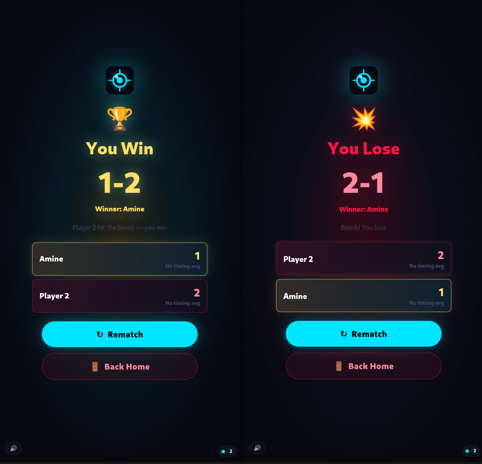

# Aim Duel

Aim Duel is a small real-time 1v1 reaction game: two players join a room, and
once both are ready a sequence of targets appears — first to 10 hits wins. It
plays in the browser and runs as a container on Kubernetes. This repository holds
the application along with the manifests and pipeline that deploy it.

**Live:** https://a.aminelg.com

[](https://github.com/Amine-LG/aim-duel/actions/workflows/build-push.yml)

I built it as a portfolio project to run a real, internet-facing service on
Kubernetes end to end. A real-time game is a good fit for that: it isn't a simple
request/response app, so the deployment details actually matter. It keeps
long-lived WebSocket connections open, holds match state in memory, and has to
cope with players disconnecting and reconnecting mid-match — which is what makes
readiness, graceful shutdown, and the single-vs-multiple-replica question
meaningful here.

## How it works

The backend is a single Node process. Express serves the built React single-page
app and the Socket.IO WebSocket endpoint on the same port (3000), so the whole
thing ships as one container — no separate API server, database, or cache. Game
state (rooms, scores, and the timers that drive each match) lives in memory in the
pod. Prometheus metrics are exposed on a second port (9091) that the ingress does
not route, so they stay internal to the cluster.



## Deployment

The cluster is managed with GitOps. Pushing to `main` triggers a GitHub Actions
workflow that builds the container image, pushes it to GHCR tagged with the commit
SHA, and updates the image tag in the Kustomize manifests. Argo CD watches the
repository and applies any change to the cluster, so the running state always
matches Git — rolling back is a `git revert`. Traffic reaches the app through
ingress-nginx, and cert-manager issues and renews the TLS certificate.



## See it running

The Grafana dashboard and the Argo CD application:

| Grafana — workload dashboard | Argo CD — application tree |
|:---:|:---:|
|  |  |

The app:

<table>
  <tr>
    <td width="50%"></td>
    <td width="50%"></td>
  </tr>
  <tr>
    <td width="50%"></td>
    <td width="50%"></td>
  </tr>
</table>

## Single replica, on purpose

The Deployment runs `replicas: 1` with the `Recreate` strategy and no autoscaler.
Room and match state — including the live `setTimeout` handles that drive a match —
is held in the pod's memory and is not shared, so a second replica could not see
the first one's rooms and broadcasts would not cross pods. `Recreate` avoids ever
running two stateful pods at once during a rollout; the trade-off is that a deploy
ends any matches in progress (clients reconnect to a clean state). Running more
than one replica would need a shared broadcast and room-ownership layer first —
see the next section.

## Possible next steps

If I keep building on it, the natural order would be:

1. **Multi-replica** — move shared state to Redis (the Socket.IO Redis adapter for
   cross-pod broadcasts, plus shared presence and room ownership), then run more
   than one replica with a `RollingUpdate` strategy, a PodDisruptionBudget, and an
   HPA.
2. **Progressive delivery** — Argo Rollouts canary deploys with automatic rollback
   based on the metrics already collected.
3. **Alerting** — `PrometheusRule` alerts (target down, event-loop latency, error
   budget) on top of the existing metrics.

## Tech stack

| Layer | Tools |
|---|---|
| Runtime | Node 22, Express 4, Socket.IO 4, React + Vite |
| Container | OCI multi-stage image (`Containerfile`, `node:22-slim`); builds with Podman/Buildah or Docker |
| Kubernetes | Kustomize, ingress-nginx, cert-manager, Argo CD |
| Observability | prom-client, Prometheus, Grafana (kube-prometheus-stack) |
| CI | GitHub Actions → GHCR (image tagged by commit SHA) |

<details>
<summary><strong>Run it locally</strong></summary>

```bash
npm --prefix backend install
npm --prefix frontend install

npm --prefix backend start        # backend on http://localhost:3000
npm --prefix frontend run dev     # Vite on http://localhost:5173 (proxies /socket.io)
```

Or the whole thing as one container, exactly as it ships:

```bash
podman build -t aim-duel:local .
podman run --rm -p 3000:3000 aim-duel:local   # http://localhost:3000
```

</details>

<details>
<summary><strong>Deploy to a cluster</strong></summary>

```bash
kubectl apply -k k8s/
kubectl -n aim-duel rollout status deploy/aim-duel
kubectl -n aim-duel get pods,svc,ingress
```

The ServiceMonitor and Grafana dashboard require kube-prometheus-stack on the
cluster (install it before applying, so the `ServiceMonitor` CRD exists). The
Ingress host is set in `k8s/03-ingress.yaml`; point your DNS at the ingress
controller and cert-manager issues the TLS certificate.

</details>

<details>
<summary><strong>Configuration</strong> (environment variables)</summary>

| Variable | Default | Purpose |
|---|---|---|
| `PORT` | `3000` | HTTP/WebSocket listen port |
| `METRICS_PORT` | `9091` | Private Prometheus metrics port (never ingress-routed) |
| `ALLOWED_ORIGINS` | (dev list) | Extra cross-origin allow-list; same-origin is always allowed |
| `PUBLIC_ORIGIN` | `http://localhost:$PORT` | Backstop for server-built invite links |
| `SHUTDOWN_DRAIN_MS` | `750` | How long `/ready` reports 503 before teardown |
| `SHUTDOWN_FORCE_EXIT_MS` | `8000` | Hard bound for graceful shutdown |
| `MAX_ROOMS` | `200` | Concurrent-room cap |

</details>

## Repository layout

```
backend/        Node + Express + Socket.IO — serves the SPA and the WebSocket, exposes /metrics
frontend/       React + Vite SPA, built into the image
Containerfile   Multi-stage OCI build: frontend dist + production backend deps
k8s/            Kustomize manifests: namespace, deployment, service, ingress,
                ServiceMonitor, Grafana dashboard
docs/img/       Screenshots used in this README
```
